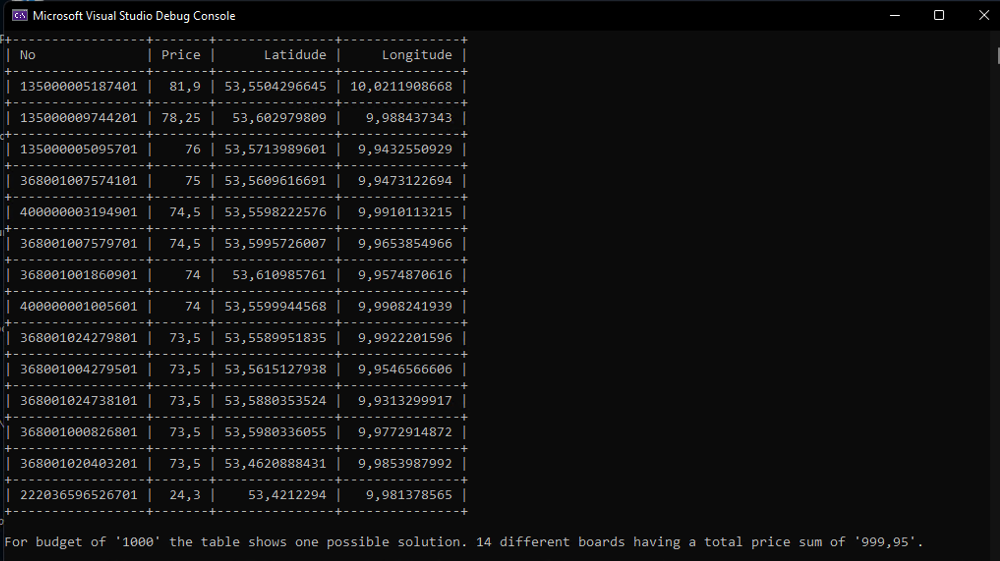

# BillboardCaseStudy

## Code Sample ##

Repo contains sample code how I would solve the given problem. In addition to solving the problem I also included some best bractices I tend to use, like how I tend to organize unit tests compared to production code and principles like DI.

Project structure:
- BollboardCaseStudy.Contracts: Abstractions and interfaces
- BillboardCaseSturdy: Implementations for the interfaces, DI setup, main program
- BillboardCaseStudy.Tests: Tests

I'm convinced that my algorithm to solve the problem is not the best possible solution.

## Geographic distribution of billboards ##

Some random notes for further discussion.

- Hamburg is not a plan land (plattes land). We have trees, buildings, lots of bridges and water. Not every place fits to place a billboard, eventho it might be funny to have submarine boards :)
- Some billboards might need electricity, others not
- Billboards might be already 'in use'
- I could imagine not every advertisment fits every location in Hamburg. Its probably good to have different zones in Hamburg for different kinds of ads
- 'Distance' could be an additional constraint for the coding sample
- Long/Lat is one specific point, but a billboard has different sizes. I guess taking billboard sizes into account is to much but ... who knows
